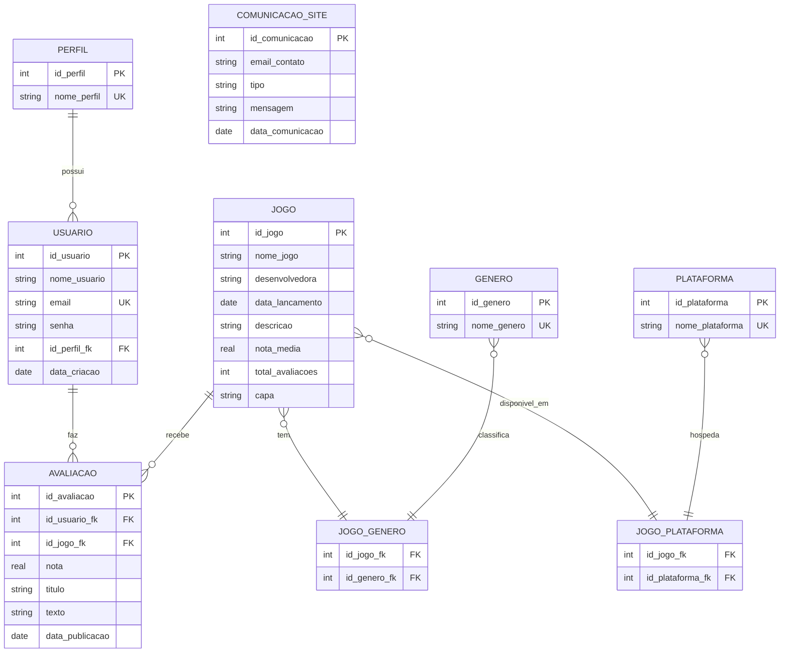

# Diagrama ERD — GameRate API

Diagrama de Entidade-Relacionamento do banco de dados SQLite da aplicação GameRate.

## Explicação dos Relacionamentos

### Relacionamentos 1:N (Um-para-Muitos)
- **PERFIL → USUARIO** (1:N): Um perfil pode estar associado a vários usuários.
- **USUARIO → AVALIACAO** (1:N): Um usuário pode fazer várias avaliações.
- **JOGO → AVALIACAO** (1:N): Um jogo pode receber várias avaliações.

### Relacionamentos N:N (Muitos-para-Muitos)
- **JOGO ↔ GENERO** (N:N via JOGO_GENERO): Um jogo pode ter vários gêneros; um gênero pode classificar vários jogos.
- **JOGO ↔ PLATAFORMA** (N:N via JOGO_PLATAFORMA): Um jogo pode estar disponível em várias plataformas; uma plataforma pode hospedar vários jogos.

### Entidade Independente
- **COMUNICACAO_SITE**: Formulário de contato público, sem relacionamentos com outras tabelas.

## Restrições de Integridade

- **Chaves Primárias (PK)**: Identificam unicamente cada registro.
- **Chaves Estrangeiras (FK)**: Garantem referência a registros existentes em outras tabelas.
- **Unique (UK)**: Impedem duplicação de certos campos (`email`, `nome_perfil`, `nome_genero`, `nome_plataforma`).

### Restrições Compostas (implementadas no banco, não renderizadas aqui)

- **AVALIACAO**: `UNIQUE (id_usuario_fk, id_jogo_fk)` — garante uma única avaliação por par usuário/jogo.
- **JOGO_GENERO**: `PRIMARY KEY (id_jogo_fk, id_genero_fk)` — chave primária composta (tabela de junção).
- **JOGO_PLATAFORMA**: `PRIMARY KEY (id_jogo_fk, id_plataforma_fk)` — chave primária composta (tabela de junção).

## Notação da Cardinalidade

No diagrama Mermaid ERD:
- `||` = exatamente um
- `}o` = zero ou muitos
- `--` = relacionamento simples
