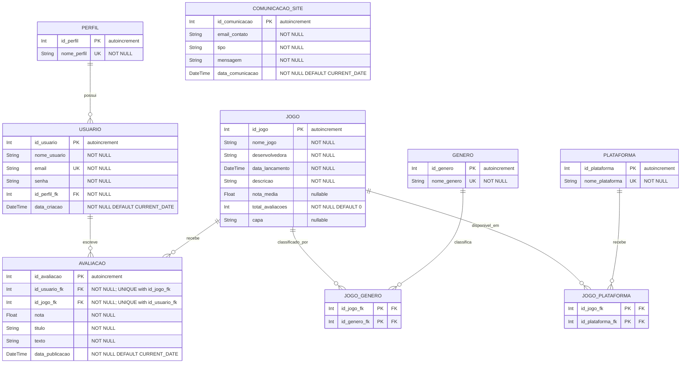

# ERD — GameRate

Este diagrama corresponde aos nove models e às tabelas `@@map` de
`prisma/schema.prisma`. Os tipos representam os tipos Prisma; campos `?` são
nullable no SQLite. `PK`, `FK` e `UK` indicam chave primária, estrangeira e
unicidade.

```mermaid
erDiagram
    PERFIL ||--o{ USUARIO : possui
    USUARIO ||--o{ AVALIACAO : escreve
    JOGO ||--o{ AVALIACAO : recebe
    JOGO ||--o{ JOGO_GENERO : classificado_por
    GENERO ||--o{ JOGO_GENERO : classifica
    JOGO ||--o{ JOGO_PLATAFORMA : disponivel_em
    PLATAFORMA ||--o{ JOGO_PLATAFORMA : recebe

    PERFIL {
        Int id_perfil PK "autoincrement"
        String nome_perfil UK "NOT NULL"
    }
    USUARIO {
        Int id_usuario PK "autoincrement"
        String nome_usuario "NOT NULL"
        String email UK "NOT NULL"
        String senha "NOT NULL"
        Int id_perfil_fk FK "NOT NULL"
        DateTime data_criacao "NOT NULL DEFAULT CURRENT_DATE"
    }
    JOGO {
        Int id_jogo PK "autoincrement"
        String nome_jogo "NOT NULL"
        String desenvolvedora "NOT NULL"
        DateTime data_lancamento "NOT NULL"
        String descricao "NOT NULL"
        Float nota_media "nullable"
        Int total_avaliacoes "NOT NULL DEFAULT 0"
        String capa "nullable"
    }
    AVALIACAO {
        Int id_avaliacao PK "autoincrement"
        Int id_usuario_fk FK "NOT NULL; UNIQUE with id_jogo_fk"
        Int id_jogo_fk FK "NOT NULL; UNIQUE with id_usuario_fk"
        Float nota "NOT NULL"
        String titulo "NOT NULL"
        String texto "NOT NULL"
        DateTime data_publicacao "NOT NULL DEFAULT CURRENT_DATE"
    }
    GENERO {
        Int id_genero PK "autoincrement"
        String nome_genero UK "NOT NULL"
    }
    JOGO_GENERO {
        Int id_jogo_fk PK "FK"
        Int id_genero_fk PK "FK"
    }
    PLATAFORMA {
        Int id_plataforma PK "autoincrement"
        String nome_plataforma UK "NOT NULL"
    }
    JOGO_PLATAFORMA {
        Int id_jogo_fk PK "FK"
        Int id_plataforma_fk PK "FK"
    }
    COMUNICACAO_SITE {
        Int id_comunicacao PK "autoincrement"
        String email_contato "NOT NULL"
        String tipo "NOT NULL"
        String mensagem "NOT NULL"
        DateTime data_comunicacao "NOT NULL DEFAULT CURRENT_DATE"
    }
```

## Cardinalidade

- `Perfil 1:N Usuario`: cada usuário referencia exatamente um perfil; um perfil pode pertencer a zero ou muitos usuários.
- `Usuario 1:N Avaliacao` e `Jogo 1:N Avaliacao`: cada avaliação tem exatamente um autor e um jogo.
- `Jogo N:N Genero`, implementado por `JogoGenero` com PK composta (`id_jogo_fk`, `id_genero_fk`).
- `Jogo N:N Plataforma`, implementado por `JogoPlataforma` com PK composta (`id_jogo_fk`, `id_plataforma_fk`).
- Cada registro de junção aponta para exatamente um jogo e um gênero/plataforma; `ComunicacaoSite` não possui relacionamento.

## Constraints e Defaults

- Campos são obrigatórios por padrão no Prisma; somente `Jogo.nota_media` e `Jogo.capa` são opcionais.
- `Usuario.email`, `Perfil.nome_perfil`, `Genero.nome_genero` e `Plataforma.nome_plataforma` são únicos.
- `Avaliacao` possui unicidade composta por usuário e jogo, impedindo avaliações duplicadas.
- IDs simples usam `autoincrement()`; as tabelas de junção usam chave primária composta.
- `Usuario.data_criacao`, `Avaliacao.data_publicacao` e `ComunicacaoSite.data_comunicacao` usam `CURRENT_DATE`; `Jogo.total_avaliacoes` usa `0`.
- `Jogo.data_lancamento` é obrigatório e não tem default.

## Apresentação

Mostre este ERD ao lado de `prisma/schema.prisma`, depois consulte os mesmos
registros no Prisma Studio. Para provar a persistência, crie um jogo pelo
front-end ou por `request.http`, atualize e consulte-o pela API, e confirme o
registro e suas relações em `npx prisma studio`.
